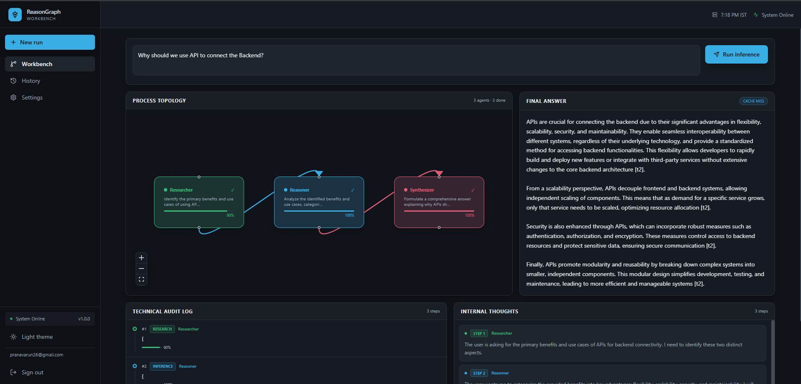

# Chain-of-Thought Visualization

> A real-time multi-agent AI system that visualizes how reasoning happens.
> 
> - Watch agents plan, research, critique, and synthesize answers
> - See execution as a live DAG
> - Inspect reasoning traces, attention, and tool usage
> 
> Built with a custom transformer in Go and a fully event-driven backend.



---

## What This Is

- A reference architecture for multi-agent AI systems
- A playground for reasoning visualization
- A foundation for building agent-based products

---

## Workbench UI

The system includes a real-time reasoning workbench:

- Visual DAG of agent execution
- Live reasoning trace (SSE streaming)
- Internal agent thoughts and tool calls
- Technical audit logs and telemetry

This makes the system not just usable — but inspectable.

---

## Why

Most AI systems are black boxes.

This project makes reasoning transparent:
- You can see how decisions are made
- You can inspect intermediate steps
- You can debug agent behavior

It’s designed for building, testing, and understanding AI systems — not just using them.

---

## Features

| Feature                      | Description                                                                                                                                                                        |
| ---------------------------- | ---------------------------------------------------------------------------------------------------------------------------------------------------------------------------------- |
| **Multi-Agent Orchestrator** | Planner → Router → Coordinator pipeline over specialized Gemini-backed agents (Researcher, Reasoner, Critic, Synthesizer, Tool) with agent-to-agent delegation and a live DAG view |
| **Custom Transformer**       | From-scratch matrix ops, multi-head attention, and layer normalization — zero external ML deps                                                                                     |
| **Firebase Auth**            | Secure, stateless authentication with zero secret management                                                                                                                       |
| **Firestore**                | Per-user chat history and collaborative rooms with scoped security rules                                                                                                           |
| **Redis Caching**            | Trace results cached with configurable TTL; `X-Cache: HIT/MISS` header on every response                                                                                           |
| **Apache Kafka**             | Event-driven async inference via `reasoning-requests` topic; traces published to `reasoning-traces`                                                                                |
| **SSE Streaming**            | Real-time server-sent events for live reasoning graph animation                                                                                                                    |
| **Docker-First**             | Multi-stage alpine build; full stack via a single `docker-compose up`                                                                                                              |
| **Zero-CGO**                 | Pure Go — portable, statically linked, minimal container image                                                                                                                     |

---

## Architecture

```
cot-backend/
├── main.go                — Entry point, wiring, graceful shutdown
├── app/                   — Next.js frontend (App Router)
├── lib/
│   ├── firebase.ts        — Firebase Auth + Firestore singleton client
│   └── api.ts             — Typed client for the Go backend (all routes)
└── internal/
    ├── transformer/       — Custom transformer model & reasoning pipeline
    ├── llm/               — Gemini REST client (powers the orchestrator)
    ├── agents/            — Specialized agent roster (Researcher, Reasoner, Critic, Synthesizer, Tool)
    ├── orchestrator/      — Planner / Router / Coordinator — multi-agent DAG execution
    ├── api/               — HTTP router, protected handlers
    ├── auth/              — Firebase JWT validation middleware
    ├── kafka/             — Producer, consumer & topic management
    └── cache/             — Redis-backed caching layer
```

---

## System Design


The diagram above shows the full request flow — from the Next.js frontend through the Go backend, Redis cache, and Kafka event bus.

> **Want to edit it?** Open [`system-design.drawio`](public/assets/system-design.drawio) in [draw.io](https://draw.io) (desktop app or browser). After making changes, re-export as SVG and overwrite `public/assets/system-design.svg`. Both files are tracked in version control so the diagram stays in sync with the codebase.

---

## Infrastructure Stack

| Service       | Image                             | Purpose                                 | Port   |
| ------------- | --------------------------------- | --------------------------------------- | ------ |
| **app**       | `cot-backend` (local)             | Go HTTP backend                         | `8080` |
| **kafka**     | `confluentinc/cp-kafka:7.6.0`     | Async inference requests & trace events | `9092` |
| **zookeeper** | `confluentinc/cp-zookeeper:7.6.0` | Kafka coordination                      | `2181` |
| **redis**     | `redis:7.2-alpine`                | Trace & activation caching (persisted)  | `6379` |
| **kafka-ui**  | `provectuslabs/kafka-ui`          | Visual topic browser                    | `8090` |

> Kafka and Redis are **optional at runtime**. The server degrades gracefully when either is unavailable — reasoning still works, just without caching or event streaming.

---

## Firebase Setup

This project uses Firebase for **Auth** (frontend sign-in), **Firestore** (user data), and optionally **Firebase Hosting** (deployment).

### 1. Create a Firebase Project

1. Go to the [Firebase Console](https://console.firebase.google.com/) and click **Add project**.
2. Give it a name, disable Google Analytics if not needed, and click **Create project**.

### 2. Enable Authentication

1. In the sidebar, go to **Build** → **Authentication** → **Get started**.
2. Under **Sign-in method**, enable **Email/Password**.
3. Add test users under the **Users** tab if needed.

### 3. Enable Firestore

1. Go to **Build** → **Firestore Database** → **Create database**.
2. Choose **Start in production mode** (security rules are already configured in `firestore.rules`).
3. Pick a region closest to your users and click **Enable**.

### 4. Register a Web App

1. Go to **Project Settings** (gear icon) → **General** → scroll to **Your apps**.
2. Click the **Web** icon (`</>`), give it a nickname, and click **Register app**.
3. Copy the `firebaseConfig` object — you will need these values for `.env.local`.

### 5. Get the Project ID (for the Go backend)

1. In **Project Settings** → **General**, copy the **Project ID** at the top.
2. This goes into `FIREBASE_PROJECT_ID` in your backend `.env`.

### 6. Deploy Firestore Rules

The security rules are in [`firestore.rules`](firestore.rules). Deploy them with:

```bash
# Install the Firebase CLI if you haven't already
npm install -g firebase-tools

# Log in
firebase login

# Deploy only Firestore rules
firebase deploy --only firestore:rules
```

### 7. Deploy to Firebase Hosting (optional)

The project is configured for Firebase Hosting with Next.js framework support (`firebase.json`).

```bash
# Build the Next.js app
npm run build

# Deploy to Firebase Hosting
firebase deploy --only hosting
```

> The hosting is configured in the `us-central1` region via `frameworksBackend` in `firebase.json`. Change the region there if needed.

---

## Quick Start

### Docker Compose (Recommended)

Spins up the full stack — app, Kafka, Zookeeper, Redis, and Kafka UI — with health-checked startup ordering:

```bash
# Copy and configure environment
cp .env.example .env.local
# Edit .env.local with your Firebase credentials and other values

docker-compose up -d
```

The Go API is available at `http://localhost:8080`. Start the Next.js frontend separately:

```bash
npm install
npm run dev   # http://localhost:3000
```

### Manual / Local Development

```bash
# 1. Install Go dependencies
go mod tidy

# 2. Install Node dependencies
npm install

# 3. Configure environment
cp .env.example .env.local
# Edit .env.local — fill in Firebase credentials

# 4. (Optional) Start infrastructure only
docker-compose up -d zookeeper kafka redis

# 5. Run the Go backend
go run main.go

# 6. In a second terminal, run the Next.js frontend
npm run dev
```

---

## Try It

1. Start the stack with Docker
2. Open http://localhost:3000
3. Enter a query like:
   > "Explain how transformers work"

Watch:
- The planner build a DAG
- Agents execute step-by-step
- Reasoning stream live
- Final answer appear with trace

---

## RAG Ingestion From The n8n Workflow

The n8n workbook flow maps into this codebase as:

```text
Knowledge text -> chunk text -> Gemini embedding -> Weaviate upsert
User question -> Gemini query embedding -> Weaviate hybrid search -> agent answer
```

This project uses Weaviate for the vector database role. It replaces the
Pinecone HTTP nodes from the n8n example, while keeping the same retrieval
pattern.

Start Weaviate, then ingest your knowledge base:

```bash
docker-compose up -d weaviate
go run ./cmd/ingest -source RAG.txt
```

You can also ingest the exact inline policy style from the n8n lesson:

```bash
go run ./cmd/ingest -text "EMPLOYEE LEAVE POLICY Employees receive 12 casual leaves annually. Unused leaves cannot be carried forward."
```

Useful ingestion flags:

| Flag | Default | Purpose |
| ---- | ------- | ------- |
| `-source` | `RAG.txt` | Text file to ingest |
| `-text` | empty | Inline text to ingest instead of a file |
| `-class` | `Document` | Weaviate class used by the Researcher agent |
| `-chunk-size` | `800` | Target characters per chunk |
| `-overlap` | `80` | Character overlap for long chunks |

Once ingested, `/api/reason` and `/api/reason/stream` automatically retrieve
matching chunks through the Researcher agent before the final answer is
synthesized.

---

## Configuration

Copy `.env.example` to `.env.local` and populate the values below.

### Backend (Go)

| Variable              | Default                 | Required | Description                                                                                                                                    |
| --------------------- | ----------------------- | -------- | ---------------------------------------------------------------------------------------------------------------------------------------------- |
| `PORT`                | `8080`                  | No       | HTTP server port                                                                                                                               |
| `ALLOWED_ORIGINS`     | `http://localhost:3000` | No       | Comma-separated CORS origins                                                                                                                   |
| `FIREBASE_PROJECT_ID` | —                       | **Yes**  | Firebase project ID — used to verify token issuer and audience                                                                                 |
| `GEMINI_API_KEY`      | —                       | No\*     | Google AI Studio API key for the orchestrator's agents. When unset, agents fall back to deterministic stubs so the visualization still renders |
| `GEMINI_MODEL`        | `gemini-2.0-flash`      | No       | Gemini model ID used by all agents                                                                                                             |
| `GEMINI_EMBEDDING_MODEL` | `gemini-embedding-001` | No       | Gemini model ID used for ingestion and query embeddings                                                                                        |
| `WEAVIATE_URL`        | `localhost:8081`        | No       | Weaviate host used for RAG vector storage and retrieval                                                                                        |
| `KAFKA_BROKERS`       | —                       | No       | Comma-separated broker list (e.g. `localhost:9092`)                                                                                            |
| `KAFKA_REQUEST_TOPIC` | `reasoning-requests`    | No       | Topic for async inference requests                                                                                                             |
| `KAFKA_TRACE_TOPIC`   | `reasoning-traces`      | No       | Topic for published trace events                                                                                                               |
| `KAFKA_EVENTS_TOPIC`  | `cot-events`            | No       | Topic for CoT step events                                                                                                                      |
| `KAFKA_GROUP_ID`      | `noetic-consumer-group` | No       | Consumer group ID                                                                                                                              |
| `REDIS_URL`           | —                       | No       | Redis connection URL (e.g. `redis://localhost:6379`)                                                                                           |
| `REDIS_CACHE_TTL`     | `3600`                  | No       | Cache expiry in seconds                                                                                                                        |

### Frontend (Next.js)

| Variable                                   | Where to find it                             | Description                                         |
| ------------------------------------------ | -------------------------------------------- | --------------------------------------------------- |
| `NEXT_PUBLIC_API_URL`                      | Set to `http://localhost:8080` for local dev | Go backend origin used by the Next.js rewrite proxy |
| `NEXT_PUBLIC_FIREBASE_API_KEY`             | Project Settings → General → Your apps       | Firebase web app API key                            |
| `NEXT_PUBLIC_FIREBASE_AUTH_DOMAIN`         | Project Settings → General → Your apps       | Auth domain (e.g. `your-project.firebaseapp.com`)   |
| `NEXT_PUBLIC_FIREBASE_PROJECT_ID`          | Project Settings → General                   | Firebase project ID                                 |
| `NEXT_PUBLIC_FIREBASE_STORAGE_BUCKET`      | Project Settings → General → Your apps       | Storage bucket URL                                  |
| `NEXT_PUBLIC_FIREBASE_MESSAGING_SENDER_ID` | Project Settings → General → Your apps       | Cloud Messaging sender ID                           |
| `NEXT_PUBLIC_FIREBASE_APP_ID`              | Project Settings → General → Your apps       | Web app ID                                          |

---

## Authentication

The Go backend validates **Firebase ID tokens** issued by Google's auth service.

### How it works

1. The user signs in via the Next.js frontend using Firebase Auth (Email/Password or any enabled provider).
2. Firebase issues an RS256-signed ID token.
3. The frontend attaches it to every API request: `Authorization: Bearer <ID_TOKEN>`.
4. The Go backend fetches Google's public JWKS from:
   `https://www.googleapis.com/service_accounts/v1/jwk/securetoken@system.gserviceaccount.com`
   and validates the token's signature, issuer (`https://securetoken.google.com/<project-id>`), and audience (`<project-id>`).

No shared secret. No manual key rotation.

### Token refresh

Firebase ID tokens expire after 1 hour. The `lib/firebase.ts` client calls `user.getIdToken(forceRefresh)` — pass `true` before sensitive calls to always get a fresh token.

---

## API Reference

<details>
<summary><strong>View API Documentation</strong></summary>

### `GET /health` — Public

Returns service health.

```json
{ "status": "ok", "version": "1.0.0" }
```

---

### `GET /auth/me` — Protected

Validates the Firebase ID token and returns the decoded claims.

```json
{
  "user_id": "firebase-uid",
  "email": "user@example.com",
  "issued_at": "2026-01-01T00:00:00Z",
  "expires_at": "2026-01-01T01:00:00Z",
  "aud": ["your-firebase-project-id"]
}
```

---

### `POST /api/reason` — Protected

Runs the full multi-agent orchestrator and returns the combined trace. Checks Redis first and returns cached results when available.

**Response headers:** `X-Cache: HIT` or `X-Cache: MISS`

**Request**

```json
{ "query": "explain multi-head attention" }
```

**Response** — a structured reasoning trace containing the planned DAG (`plan`), per-agent executions (`agents`), any agent-to-agent `delegations`, flattened CoT steps, attention weights, and activation signals.

---

### `POST /api/reason/stream` — Protected

SSE stream for live multi-agent reasoning. Replays from cache when a prior trace is found.

**Event types:**

| Event           | Description                                                           |
| --------------- | --------------------------------------------------------------------- |
| `meta`          | Trace metadata (cache status)                                         |
| `plan`          | Full DAG plan emitted by the Planner before execution begins          |
| `agent_start`   | An agent has begun its task (id, name, role, depends_on)              |
| `agent_thought` | An agent's internal reasoning                                         |
| `agent_done`    | Completed `AgentRun` — output, confidence, timing                     |
| `delegation`    | One agent handing sub-work to another                                 |
| `cot_step`      | Flattened reasoning step (back-compat with the step panel)            |
| `tool_call`     | Tool invocation captured during the run                               |
| `attention`     | Attention weight matrix snapshot (from the parallel transformer pass) |
| `activation`    | Layer activation values                                               |
| `done`          | Stream termination signal with final answer                           |

---

### `GET /api/kafka/status` — Protected

Returns Kafka broker connectivity and topic availability.

---

### `GET /api/cache/status` — Protected

Returns Redis connectivity, configured TTL, and hit/miss counters.

</details>

---

## Testing

```bash
# Run all Go tests
go test ./... -v

# Transformer benchmarks
go test ./internal/transformer/... -bench=. -benchmem
```

---

## License

This project is licensed under the GNU General Public License v3.0 - see the [LICENSE](LICENSE) file for details.
